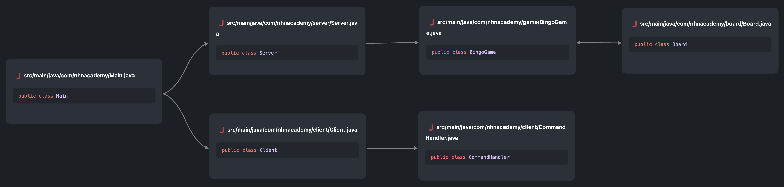

# nhn-bingo
NHN Academy 빙고 팀 과제 저장소

# 🛠️ 구현 기능
## 📺 (남지민) 커맨드라인 옵션 기능
- 기본은 클라이언트로 동작한다.
- s 옵션을 주면 서버로 동작한다.
- h <hostname> 옵션을 주면 주소를 설정한다.
  - 기본은 localhost이다.
- p <port> 옵션을 주면 포트를 설정한다.
  - 기본은 1234이다.

## 🖥️ (남지민) 서버 기능
- 서버 소켓을 만들고 대기한다.
- 클라이언트와 연결한다.
- reader, writer를 연다.

## 📝 (남지민) 보드 기능
- 현재 보드판 상태를 반환한다.
- 빙고인지 확인한다.
  - 세로축, 가로축, 대각선을 확인한다.
- 보드에 선택한 번호를 표시한다.
  - 이미 선택된 번호일 경우 예외를 던진다.

## 💻 (이정용) 클라이언트 기능
- 서버와 연결한다.
- reader, writer를 연다.

## 🎛️ (이정용) 명령 핸들링 기능
- 서버로부터 받은 명령을 실행한다.
  - start 명령을 받으면 빙고판을 입력받는다.
  - repaint 명령을 받으면 화면에 보드판을 그린다.
  - select 명령을 받으면 선택할 번호를 입력받는다.
  - win 명령을 받으면 승리 처리를 한다.
  - lose 명령을 받으면 패배 처리를 한다.

## 🎮 (이정용) 빙고 게임 진행 기능
- 빙고 게임을 진행한다.
  - 클라이언트에게 게임이 시작했음을 알린다.
  - 보드판을 만들기위해 입력을 받는다.
  - 서버와 클라이언트의 보드판을 만든다.
  - 순서에 맞게 번호를 선택받는다.
  - 보드를 갱신하고 화면에 표시한다.
  - 승부가 났는지 확인하고 승패 처리를 한다.
